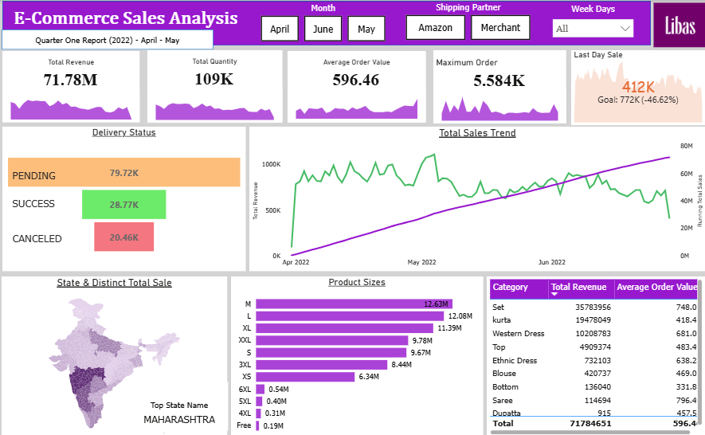

# E-Commerce Sales Analysis

## 1. Company Background
An online retail store launched with the ambitions of clearing thousands of doubts related to fashion & lifestyle, we inspire consumers to make fashion and lifestyle choices that best suit them. They have a wide assortment of offerings across established national brands, international brands, luxury brands, and emerging labels and designers.Now company is facing multiple operational challenges that create hindrance in achieving its own goal.

## 2. Problem Statement
The company is currently experiencing operational gaps across multiple areas, including financial, logistics, product management, and customer satisfaction.
To drill down into these issues, the company is leveraging data-driven insights to optimize operations.So company aims to analyze the their e-commerce data to identify and understand business trends, and provide data-driven recommendations to improve sales performance, logistics efficiency, product strategy, and customer satisfaction.

## 3. Project Objectives
 - Examine revenue trends across April–June 2022 to identify peak and low-performing periods, and uncover the reasons behind the declining sales trajectory.
 -  Identify top-selling categories (Sets, Kurtas) and underperforming ones (Sarees, Dupattas, Tops) to guide inventory and marketing decisions.
 -  Analyze state and city-level performance to explain the dominance of South India and Tier-1 metros, and identify growth opportunities in North India and Tier-2 cities.
 -  Use insights from Excel, Python (Pandas), and Power BI to deliver actionable strategies that address operational gaps in finance, logistics, and product management.

## 4. Tools Stack
| Tools | Usage |
|-------|----------|
| MS-EXCEL | IT HELPS IN OPENING THE CSV FILE AND UNDERSTANDING THE DATA STRUCTURE |
| Python(pandas & matplotlib) | PANDAS WAS USED FOR TRANSFORMING THE RAW DATA, HANDELING THE MISSING VALUES AND CREATING THE NEW COLUMNS. |
| PowerBI | THROUGH THE POWER BI WE HAVE MADE THE INTERACTIVE DASHBOARD WHICH IS EASIER TO ANALYZE SALES TRENDS, PRODUCT PERFORMANCE AND CUSTOMER BEHAVIOR. |

## 5. Key Operational Challenges & Business Impact
| Challenge | Business Impact |
|:---|:---|
| Declining Sales Trend | Reduces overall revenue growth, weakens business performance, and creates difficulty in achieving sales targets. |
| Abnormal Distribution of Product | Leads to stock imbalance, where some products are overrepresented while others face low availability, affecting sales efficiency and customer demand. |
| Poor Order Fulfillment | Delays deliveries, increases pending or cancelled orders, and negatively impacts customer satisfaction and brand trust. |
| Lower Sales in North Side States | Shows weak market penetration in northern regions, limiting business expansion and reducing contribution from a large customer base. |
| Unexpected Demand from Tier-Two Metro Cities | Creates pressure on inventory and logistics planning, as demand may rise in regions where the company is not fully prepared operationally. |

## 6. Charts Walkthrough
| # | Chart Name | Chart Type | Key Takeaways|
|---|------------|------------|--------------|
| 1 | Total Revenue | KPI Card with Sparkline | Total revenue is 71.78M with a trend line showing fluctuation over the period |
| 2 | Total Quantity | KPI Card with Sparkline | 109K units were ordered, with the sparkline showing order volume over time |
| 3 | Average Order Value | KPI Card with Sparkline | Average order value stands at ₹596.46 across all transactions |
| 4 | Maximum Order | KPI Card with Sparkline | The highest single order was ₹5,584, with peak activity visible in the sparkline |
| 5 | Last Day Sale | KPI Card with Area Chart | Last day sales were 412K, falling short of the 772K goal by -46.62% |
| 6 | Delivery Status | Horizontal Bar Chart | Most orders are Pending (79.72K), followed by Successful (28.77K) and Cancelled (20.46K) — a high pending ratio is a concern |
| 7 | Total Sales Trend | Dual-Axis Line Chart | The green line (Total Revenue) shows volatile but growing daily sales from Apr–Jun 2022; the purple line (Running Total) shows a steady cumulative increase reaching ~80M |
| 8 | State & District Total Sale | Choropleth Map | Maharashtra has the darkest shading, making it the top-performing state by sales; southern and western regions show moderate activity |
| 9 | Product Sizes | Horizontal Bar Chart | Size M leads at 12.63M, followed by L (12.08M) and XL (11.39M); larger sizes (4XL, 5XL, Free) contribute very little revenue |
| 10 | Category Revenue Table | Data Table | Sets are the top category at ₹35.78M with the highest AOV of ₹748; Kurta and Western Dress follow; Dupatta has the lowest revenue at ₹915 |

## 7. Recomendation
- **Product Management:** Conduct a deep-dive analysis into the reasons for the low sales of "Saree," "Dupatta," and "Top" .
- **Expand The Market Share:** Expand marketing and supply chain focus in  North India to maximize sales growth.
- **Improve Order Service:** Accelerate order fulfillment and resolve May–June backlog to reduce cancellations and improve customer trust.
- **Target Tier-1 Metro City:** Focus on Tier-1 metros with targeted campaigns; expand gradually into Tier-2 cities.

## 8. Conclusion
OUR ANALYSIS HIGHLIGHTS SIGHNIFICANT OPERATIONAL GAP IN KEY BUSINESS AREA INCLUDING FINANCE, LOGISTICS AND PRODUCT. KEY FINDINGS SUCH AS ABNORMAL PRODUCT DISTRIBUTION, POOR ORDER STATUS, ONE-SIDED FOCUSES ON REGION ARE THE CONTRIBUTING FACTORS TO DECLINE IN OVERALL SALES PERFORMANCE.
CORRECTIVE ACTION THAT COMPANY SHOULD TAKE ARE IMPOROVE DELIVERY TIME, PRIORITIZING HIGH-POPULATED STATES, MAKING STRATEGY TO INCREASE THE  DEMAND OF LOW SELLING ITEMS ETC.

## Screenshot

